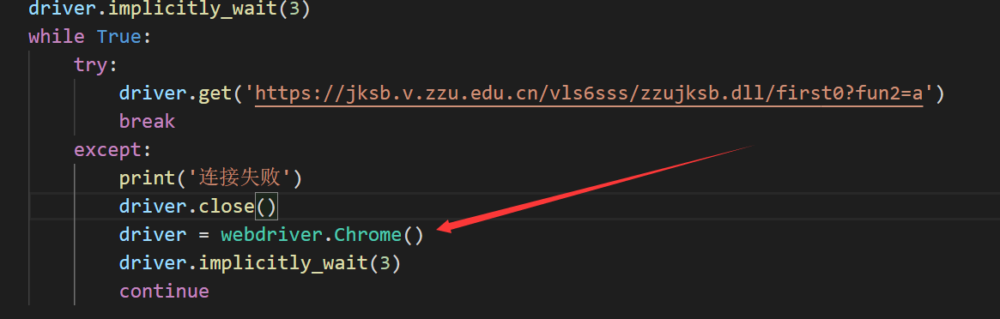
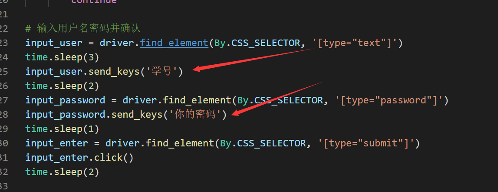
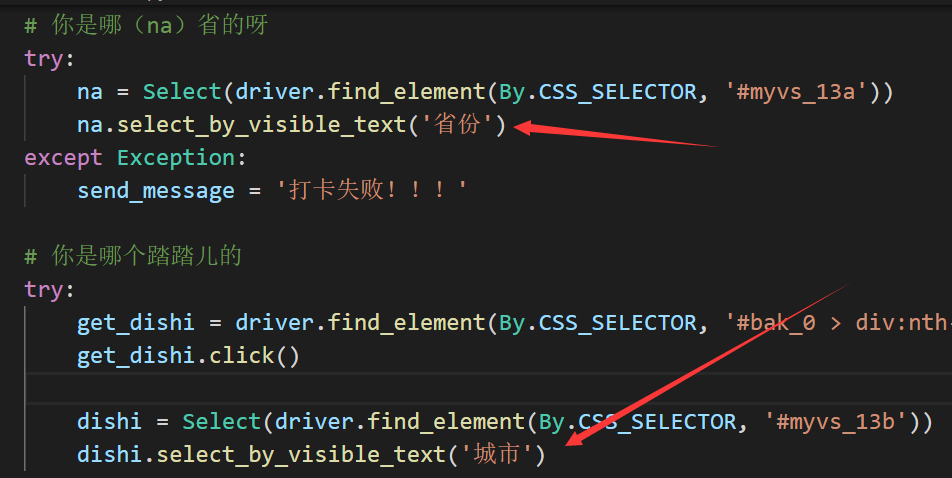
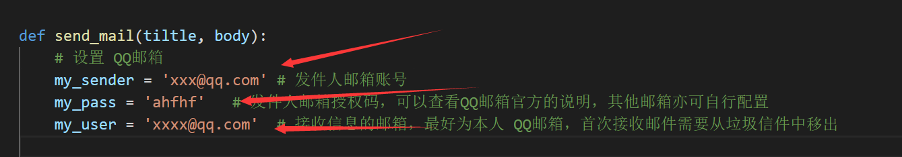
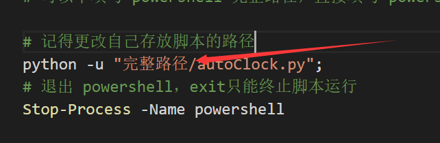

# ZZU 自动健康打卡器说明

程序仅供个人免费试用，造成不可控后果概不负责！！！

主要为了自己用着方便，很多东西不是面向用户设计，因此不做 GUI，也不用配置文件（本来也没几行，懒得搞，鸽了！）🕊️

由于 python 打包 exe 非常 shit ，暂不考虑做 exe（鸽了！）🕊️

未配置 SSL ，麻烦，不会，能用就行（鸽了！）🕊️

自动打卡解决方案为 python + selenium + windows 任务计划

邮件提醒解决方案为 QQ邮箱 SMTP 服务

（ZZU！！！我今天打算放项目上来，你今天就改打卡系统？）

## 环境配置

1. 安装 python，自行解决🕊️
2. 安装 selenium ，powershell 或 cmd 下运行 pip install selenium
3. 安装 webdriver，此处看个人电脑上是什么浏览器，Chrome，Edge，Firefox，Safari都可以
    安装教程 [教程链接](https://www.cnblogs.com/ellencode/p/11327389.html)
    需要修改下列参数到对应浏览器（建议使用 Chrome）
    webdriver.exe 放到 python 安装目录下的 Scripts 目录下（不依照教程链接中的方法，按我的！），例如我的就是：
    C:\Users\pserimal\AppData\Local\Programs\Python\Python38-32\Scripts

    在 [autoClock.py](autoClock.py) 中

    

    ```python
    driver = webdriver.Chrome()
    # driver = webdriver.Firefox()
    # driver = webdriver.Edge()
    # driver = webdriver.Safari()
    ```


## 需要配置的参数

学号和密码、地市信息在 [autoClock.py](autoClock.py) 中

1. 学号和密码

    

    ```python
    input_user.send_keys('学号')
    time.sleep(2)
    input_password = driver.find_element(By.CSS_SELECTOR, '[type="password"]')
    input_password.send_keys('你的密码')
    ```

2. 地市

    
   
   按照自己之前打卡的地市信息填写即可

3. 邮箱

    在 [send_email.py](send_email.py) 中的信息
   
    发件人邮箱和收件人邮箱及发件人邮箱授权码

    

    ```python
        my_sender = 'xxx@qq.com' # 发件人邮箱账号
    my_pass = 'ahfhf'   # 发件人邮箱授权码，可以查看QQ邮箱官方的说明，其他邮箱亦可自行配置
    my_user = 'xxxx@qq.com'  # 接收信息的邮箱，最好为本人 QQ邮箱，首次接收邮件需要从垃圾信件中移出

    ```

## 添加 win10 任务计划

用 ps.ps1 脚本创建 windows 任务计划
建议添加晚上一个计划，早上一个计划（半夜十二点打卡人多）
关机无法运行任务计划

在 [ps.ps1](ps.ps1) 中



更改自己的脚本路径
关于配置 win10 任务计划的教程 [教程](https://www.cnblogs.com/lishidefengchen/p/4381565.html)

peace！！（鸽！）🕊️
